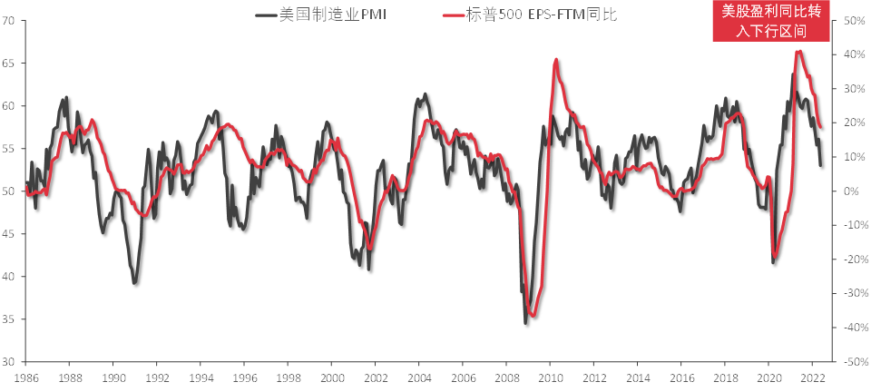

## 经济周期的定义

学术上，实际GDP低于潜在增速定义为衰退。但在业界，一般在讨论经济周期的时候，通常引用[NBER](https://www.nber.org/)对经济周期的定义。

## 经济周期观察指标

观察经济运行的指标很多，能比较好解释经济周期的指标主要有：

-   [ISM PMI](https://www.ismworld.org/supply-management-news-and-reports/reports/ism-report-on-business/)
-   NBER经济周期观察指标
-   综合指数
-   市场利差
-   通胀与失业率情景分析

### ISM PMI

ISM PMI is a monthly gauge of the level of economic activity in the manufacturing sector in the United States versus the previous month.

The ISM Manufacturing Index is published monthly and is an important leading indicator of the U.S. economy. The reason that this economic indicator is forward-looking is how far ahead purchasing decisions need to be made for future manufacturing needs.

The index is based on a survey of purchasing and supply executives (i.e., individuals who are responsible for their firm’s supply chains) in over 400 manufacturing companies, representing 20 different industries across all 50 states out of the more than 50,000 members of the ISM. Survey participants are asked whether conditions have improved or deteriorated in 10 specific areas, or subindexes:

- New Orders
- Production
- Employment
- Inventories
- Supplier Deliveries
- Customers’ Inventories
- Prices
- Backlog of Orders
- New Export Orders
- Imports

PMI与企业盈利周期基本匹配。PMI有一点点领先性。体现在:

-   PMI与NBER周期
-   周期与上市企业EPS
-   美国制造业PMI与S&P 500

### NBER周期观察指标

NBER周期是行业同行定义。NBER六大指标体系：

-   实际个人收入（扣除转移支付），滞后指标
-   非农薪资就业
-   就业（家庭调查），滞后指标
-   实际个人消费支出，滞后指标
-   批发与零售实际销售额，波动最高
-   工业生产指数，波动其次

其中，批发与零售实际销售额弹性最大、波动性最高；其次工业生产指数。就业数据、个人消费支出等指标实际上是经济周期滞后指标。

### 综合指数

谘商会（巧用领先、同步与滞后指标）。

### 市场利差

几类指标：

-   国债期限利差。通常使用10Y - 3M的期限利差分析长、短期。
    -   市场预期
    -   政策意图
-   企业信用利差。

可以用Probit模型回归检查有效性。

### 使用通胀、失业率指标情景分析

### 美国经济周期与大类资产表现

## 全球金融周期的首要研究对象是美联储

美国金融占最大。

流动性周期：经济周期的领先指标。流动性周期代表风险偏好的下降。

### EMDEs组合投资净流动性

中国净流出较多。

影响EMDEs资本流动的因素：推力-拉力框架。

### 联储政策、全球金融周期和风险资产价格波动

美联储货币政策冲击，引发"全球金融周期"协同收缩。

### 金融压力指数（FSIs)

-   **芝加哥联储全国金融状况指数**
-   **OFR FSI**，美国财政部金融研究办公室

### 金融与经济共生关系

金融是经济的格兰杰因。美国金融状况指数、经济活动指数和PMI高度相关。

### 长短期金融与经济周期

长金融周期：一般跟地产市场相关，银行信贷缩表。

## Reference

1.  驾驭周期
2.  capital war
3.  彭文生，金融周期
